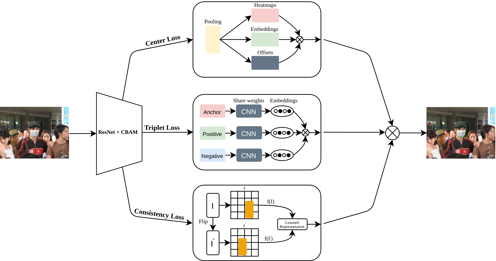
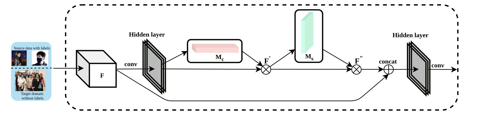

# Mask-or-Non-Mask-Robust-Face-Mask-Detector-via-Triplet-Consistency-Representation-Learning
## This is the code of the paper Mask or Non-Mask? Robust Face Mask Detector via Triplet-Consistency Representation Learning presented in ACM TOMM

## Introduction
In the absence of vaccines or medicines to stop COVID-19, one of the effective methods to slow the spread of the coronavirus andreduce the overloading of healthcare is to wear a face mask. Therefore, we propose a face mask detection framework that uses the context attention module to enable the effective attention of the feedforward convolution neural network by adapting their attention maps feature refinement. Moreover, we further propose an anchor-free detector with Triplet-Consistency Representation Learning by integrating the consistency loss and the triplet loss to deal with the small-scale training data and the similarity between masks and occlusions.

## Overall Architecture
The proposed model consists of three losses, Center Loss, Triplet Loss, and Consistency Loss.

CBAM modules are included to imporve the performance of the model.

## Installation

## Training

## Performance
